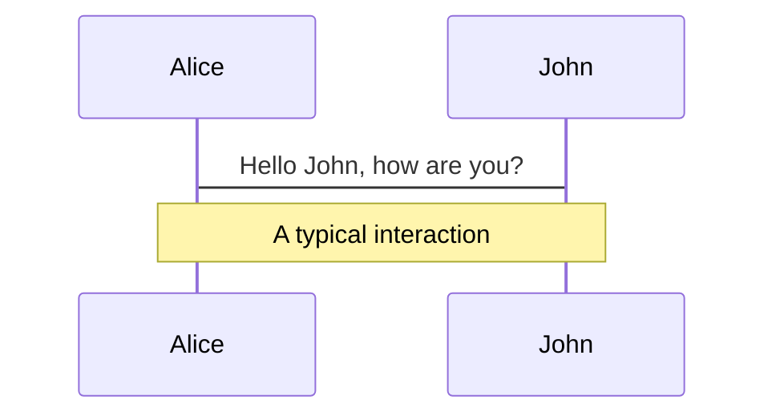
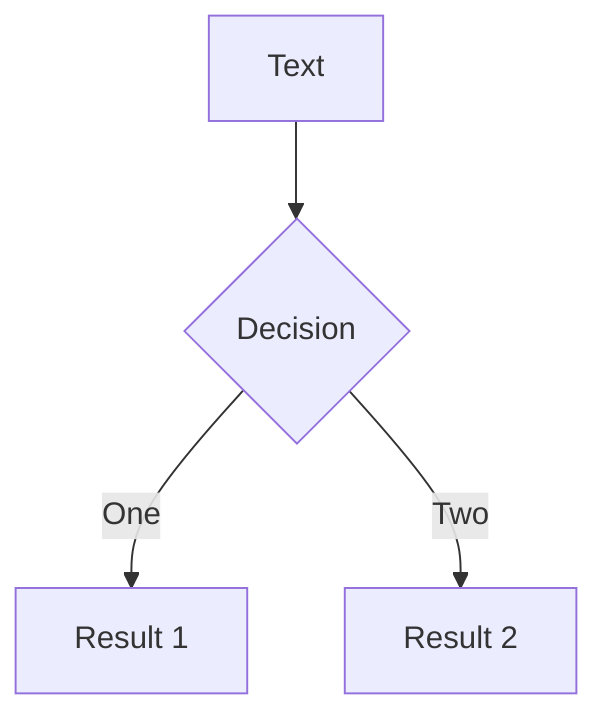
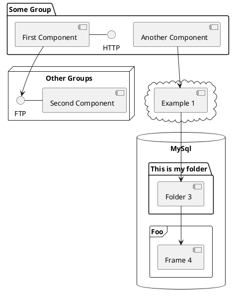

<p class="text-2em text-yellow-500"><span class="bg-dark-900 m-2 rounded bg-opacity-60"> Kedro Showcase </span></p>

### October 2022

<div grid="~ cols-2 gap-4">
<div class="pt-12">
  <div abs class="abs-bl ml-5 text-gray-500"><p class="text-xs">Best viewed in Dark mode, set it here:  <SetDarkMode/></p></div>
</div>
<div class="w-130"><KedroIcon /></div>

</div>

---
theme: apple-basic
class: text-left
highlighter: shiki
layout: iframe-right
url: https://demo.kedro.org/
---

# Today's agenda

We’re excited to show you some of the cool stuff we’re currently cooking up and our vision for the future and Kedro's place within the ML ecosystem.

<ul>
  <li><span @click="$slidev.nav.go(3)" hover="bg-white bg-opacity-10 rounded">🤖 Meet the team</span></li>
  <li><span @click="$slidev.nav.go(4)" hover="bg-white bg-opacity-10 rounded">👩‍🍳 What have the team been cooking?</span></li>
  <li><span @click="$slidev.nav.go(5)" hover="bg-white bg-opacity-10 rounded">💿 Changes to Datasets</span></li>
  <li><span @click="$slidev.nav.go(7)">📣 Feedback + Q&A</span></li>
</ul>

<Socials />

---

# Meet the team

<div class="flex">
  <div class="p-1">
      <div><h3> <br> </h3></div>
      <div class="flex p-2 gap-2">
         <div><Profile name="Ivan" role="Tech lead" github="idanov" country="🇧🇬"/></div>
         <div><Profile name="Yetu" role="Product Lead" github="yetudada" country="🇿🇦"/></div>
         <div><Profile name="Nero" role="Product" github="NeroOkwa" country="🇳🇬"/></div>
         <div><Profile name="Jo" role="Tech Writer" github="stichbury" country="🏴󠁧󠁢󠁷󠁬󠁳󠁿"/></div>
     </div>
     </div>
  
  <div class="p-1">
     <div><h3>Viz team</h3></div>
     <div class="flex p-2 gap-2">
      <div><Profile name="Tynan" role="Tech lead" github="tynandebold" country="🇺🇸"/></div>
      <div><Profile name="Rashida" role="SWE" country="🇮🇳" github="rashidakanchwala"/></div> 
      <div><Profile name="Huong" role="SWE" country="🇻🇳" github="Huongg"/></div> 
      <div><Profile name="Cvetanka" role="SWE" country="🇲🇰" github="cvetankanechevska"/></div> 
      <div></div>
      <div><Profile name="Gabriel" role="Visual Designer"  country="🇧🇷" github="GabrielComymQB"/></div>
      <div><Profile name="Andrew" role="Design Research" github="Mackay031" country="🇿🇦"/></div>
  </div></div></div>
  
  <div class="flex">
  <div class="p-1">
    <div><h3>Framework team</h3></div>
    <div class="flex p-2 gap-2">
      <div><FrameworkProfile name="Merel" role="Tech Lead" github="MerelTheisenQB" country="🇳🇱"/></div>
      <div><FrameworkProfile name="Antony" role="DS SWE" github="AntonyMilneQB" country="🇬🇧"/></div>
      <div><FrameworkProfile name="Nok" role="SWE" github="noklam" country="🇭🇰"/></div>
      <div><FrameworkProfile name="Ahdra" role="SWE" github="AhdraMeraliQB" country="🇰🇪"/></div>
      <div><FrameworkProfile name="Sajid" role="SWE" github="SajidAlamQB" country="🇬🇧"/></div>
      <div><FrameworkProfile name="Ankita" role="SWE" github="ankatiyar" country="🇮🇳"/></div>
      <div><FrameworkProfile name="Jannic" role="SWE" github="jmholzer" country="🇬🇧"/></div>
      <div><FrameworkProfile name="Deepyaman" role="DS SWE" github="deepyaman" country="🇺🇸"/></div>
    </div>
    <div class="pb-5"></div>
  </div>
</div>


---

## What have the team been cooking recently 👩‍🍳?

<h3> <br>Since March this year we have released versions <kbd>0.18.0</kbd>, <kbd>0.18.1</kbd>, <kbd>0.18.2</kbd>, and <kbd>0.18.3</kbd> 🎉<br>
Here's a look at some of the things we've done:</h3>
<div class="grid grid-cols-4 mt-3">

  <div class="w-50 m-2">
    <div class="bg-dark-500 rounded-lg flex flex-col content-between  ">
      <emojione-building-construction class="text-3em m-auto mt-2 -mb-2 h-10"/>
      <p class="text-center text-0.8em">
        Rewritten framework internals
      </p>
    </div>
  </div>

  <div class="w-50 m-2">
    <div class="bg-dark-500 rounded-lg flex flex-col content-between ">
      <logos-python class="text-3em m-auto mt-2 -mb-2 h-10"/>
        <p class="text-center text-0.8em">
          Support for Python 3.9 & 3.10
        </p>
    </div>
  </div>

  <div class="w-50 m-2">
    <div class="bg-dark-500 rounded-lg flex flex-col content-between ">
        <iconoir-packages class="text-3em m-auto mt-2 -mb-2 h-10 text-purple-400"/>
        <p class="text-center text-0.8em">
          Micropackaging workflow
      </p>
    </div>
  </div>

  <div class="w-50 m-2">
    <div class="bg-dark-500 rounded-lg flex flex-col content-between">
      <vaadin-file-tree-sub class="text-3em m-auto mt-2 -mb-2 h-10 text-blue-400"/>
        <p class="text-center text-0.8em">
          Improved interactive workflow
        </p>
    </div>
  </div>

</div>


<div class="grid grid-cols-4">
  <div class="w-50 m-2">
    <div class="bg-dark-500 rounded-lg flex flex-col content-between ">
     <mdi-hook class="text-3em m-auto mt-2 -mb-2 h-10 text-green-400"/>
        <p class="text-center text-0.8em">
          Added hooks
        </p>
    </div>
  </div>

  <div class="w-50 m-2">
    <div class="bg-dark-500 rounded-lg flex flex-col content-between ">
     <ant-design-file-search-outlined class="text-3em m-auto mt-2 -mb-2 h-10 text-blue-200"/>
        <p class="text-center text-0.8em">
          Pipeline autodiscovery
        </p>
    </div>
  </div>

  <div class="w-50 m-2">
    <div class="bg-dark-500 rounded-lg flex flex-col content-between ">
      <carbon-terminal class="text-3em m-auto mt-2 -mb-2 h-10 text-orange-400"/>
        <p class="text-center text-0.8em">
          Rich logs 
        </p>
    </div>
  </div>

  <div class="w-50 m-2">
    <div class="bg-dark-500 rounded-lg flex flex-col content-between ">
      <mdi-graph-outline class="text-3em m-auto mt-2 -mb-2 h-10 text-pink-400"/>
        <p class="text-center text-0.8em">
          Export runs from Viz
        </p>
    </div>
  </div>

</div>

<div class="grid grid-cols-4">
  <div class="w-50 m-2">
    <div class="bg-dark-500 rounded-lg flex flex-col content-between ">
    <codicon-graph class="text-3em m-auto mt-2 -mb-2 h-10 text-red-400"/>
      <p class="text-center text-0.8em">
        Plots in experiment tracking
      </p>
    </div>
  </div>

  <div class="w-50 m-2">
    <div class="bg-dark-500 rounded-lg flex flex-col content-between">
     <div class="text-3em m-auto mt-2 -mb-2 h-10 text-gray-100">  </div>
        <p class="text-center text-0.8em">
          New website
        </p>
    </div>
  </div>

  <div class="w-50 m-2">
    <div class="bg-dark-500 rounded-lg flex flex-col content-between">
      <logos-slack-icon class="text-3em m-auto mt-2 -mb-2 h-10"/>
      <p class="text-center text-0.8em">
        Kedro on Slack
      </p>
    </div>
  </div>

  <div class="w-50 m-2">
    <div class="bg-dark-500 rounded-lg flex flex-col content-between ">
      <emojione-bug class="text-3em m-auto mt-2 -mb-2 h-10"/>
        <p class="text-center text-0.8em">
          Dead bugs
        </p>
    </div>
  </div>

</div>


<Socials />

---

<h1> <vaadin-file-tree-sub class=" m-auto mr-5 ml-2 text-blue-400"/> Improved interactive workflow</h1>

---

<h1> <ant-design-file-search-outlined class=" m-auto mr-5 ml-2 text-blue-200"/> Pipeline autodiscovery</h1>

---

<h1> <carbon-terminal class=" m-auto mr-5 ml-2 text-orange-400"/> Rich logs</h1>

---

<h1> <codicon-graph class=" m-auto mr-5 ml-2 text-red-400"/> Plots on Experiment Tracking</h1>

---
layout: iframe
url: https://kedro.org/
---
<h1> New Website</h1>

---

<h1> <logos-slack-icon class=" m-auto mr-5 ml-2"/> Kedro on Slack</h1>

<!--Mention Hacktoberfest-->

---

# Placeholder slide - What has the community been up to?

---
layout: image-right
image: https://source.unsplash.com/collection/94734566/1920x1080
---

# Changes to Datasets

Use code snippets and get the highlighting directly![^1]

```ts {all|2|1-6|9|all}
interface User {
  id: number
  firstName: string
  lastName: string
  role: string
}

function updateUser(id: number, update: User) {
  const user = getUser(id)
  const newUser = {...user, ...update}  
  saveUser(id, newUser)
}
```

<arrow v-click="3" x1="400" y1="420" x2="230" y2="330" color="#564" width="3" arrowSize="1" />

[^1]: [Learn More](https://sli.dev/guide/syntax.html#line-highlighting)

<style>
.footnotes-sep {
  @apply mt-20 opacity-10;
}
.footnotes {
  @apply text-sm opacity-75;
}
.footnote-backref {
  display: none;
}
</style>

---

# Datasets: Placeholder Slide 1

[TBC]


---

# Datasets: Placeholder Slide 2

[TBC]

---

# Diagrams

You can create diagrams / graphs from textual descriptions, directly in your Markdown.

<div class="grid grid-cols-3 gap-10 pt-4 -mb-6">







</div>

[Learn More](https://sli.dev/guide/syntax.html#diagrams)

---
layout: quote
---
# 📣 Feedback + Q&A Session

<div abs class=" abs-tr mr-60 mt-52">

</div>
<Socials />
